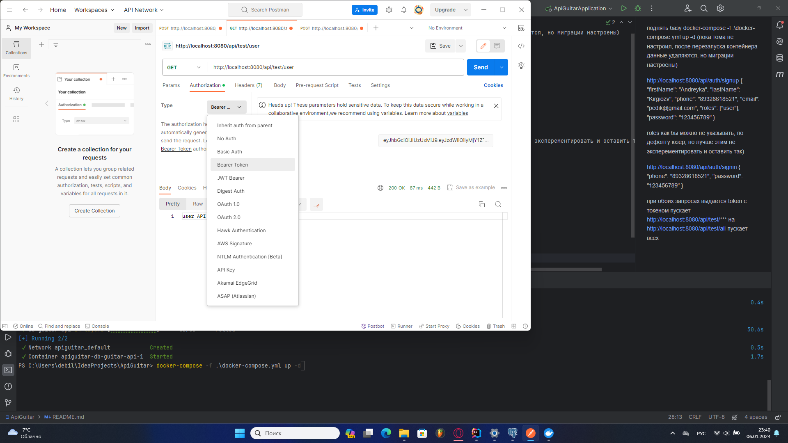

поднять базу
docker-compose -f .\docker-compose.yml up -d
(пока тома не настроил, после перезапуска контейнера данные удаляются, но миграции настроены)

http://localhost:8080/api/auth/signup
{
"firstName": "Andreyka",
"lastName": "Kirgiozv",
"phone": "89328618521",
"email": "pedik@gmail.com",
"roles": ["user"],
"password": "123456789"
}

roles как бы можно не указывать, по дефолту юзер, но лучше этим не эксперементировать и оставить так)

http://localhost:8080/api/auth/signin
{
"phone": "89328618521",
"password": "123456789"
}

при обоих запросах выдается token
с токеном пускает
http://localhost:8080/api/test/***
на
http://localhost:8080/api/test/all
пускает всех

(токен пихать сюда)
